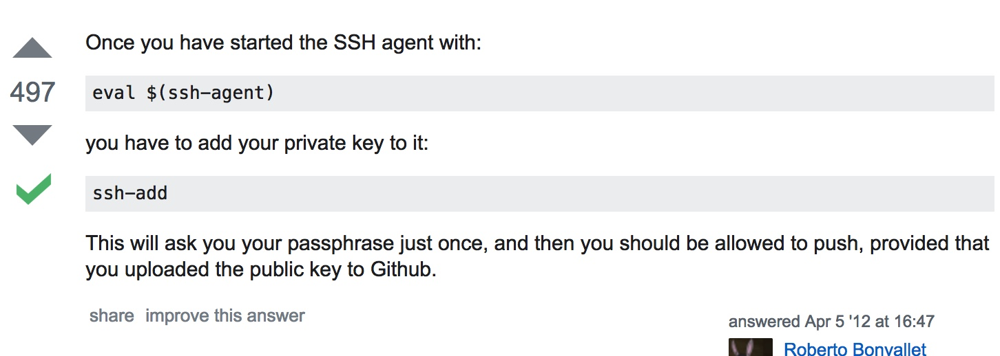
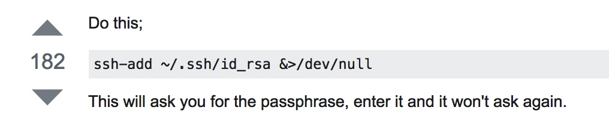

Tips-Git

Stop enter the passphrase



[](https://help.github.com/articles/duplicating-a-repository)

[](https://help.github.com/articles/duplicating-a-repository)

duplicate the repository

```sh

Open Terminal.
Create a bare clone of the repository.
	git clone --bare git@github.com:coyawa/DataVisFinal.git
Mirror-push to the new repository.
	cd old-repository.git
	git push --mirror git@github.com:coyawa/CS573-DataVisFinal.git
Remove the temporary local repository you created in step 1.
	cd ..
	rm -rf DataVisFinal.git
```

[SSH Key - Still asking for password and passphrase](http://stackoverflow.com/questions/21095054/ssh-key-still-asking-for-password-and-passphrase)

