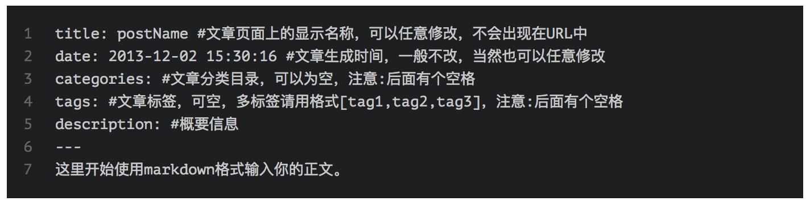

Tips-Hexo

可以尝试将 source/css/\_common/scaffolding/tables.styl 中的 table-layout: fixed;

改为 table-layout: auto;

\<br\> 表格内换行

[Markdown 表格样式调整与自适应优化 | MOxFIVE's Blog](http://moxfive.xyz/2016/03/04/markdown-table-style/)

****

在html前加入，即可不编译

**---**

**layout: false**

**---**

****

关于引用站内文章的链接，可以使用以下语法：



* markdown-learning-by-maxiang是你的文章名称。如果文章不存在，这段代码将会被直接忽略。
* 点击这里查看这篇文章是该链接的标题。如果置空，则自动提取文章的标题。

**ps**：这个功能跟主题无关。

type: "picture"

---





<http://caoyudong.com/2015/07/15/%E5%A6%82%E4%BD%95%E8%AE%A9markdown%E5%9B%BE%E7%89%87%E5%B1%85%E4%B8%AD/>

Markdown 图片居中

blog about the config of my laptop, assume I bought a new macbook

草稿

草稿相当于很多博客都有的“私密文章”功能。使用如下命令创建：

$ hexo new draft "new draft"

会在source/\_drafts目录下生成一个new-draft.md文件。但是这个文件不被显示在页面上，链接也访问不到。也就是说如果你想把某一篇文章移除显示，又不舍得删除，可以把它移动到\_drafts目录之中。

如果你希望强行预览草稿，更改配置文件（\_config.yml）：
 $ render\_drafts: true
 或者如下方式启动server：
 $ hexo server --drafts

下面这条命令可以把草稿变成文章，或者页面：

$ hexo publish draft "draft name"

[在hexo中使用草稿-friendley 's Blog](http://blog.leanote.com/post/friendley/%E5%9C%A8hexo%E4%B8%AD%E4%BD%BF%E7%94%A8%E8%8D%89%E7%A8%BF)

