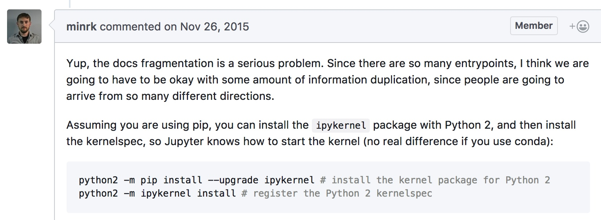
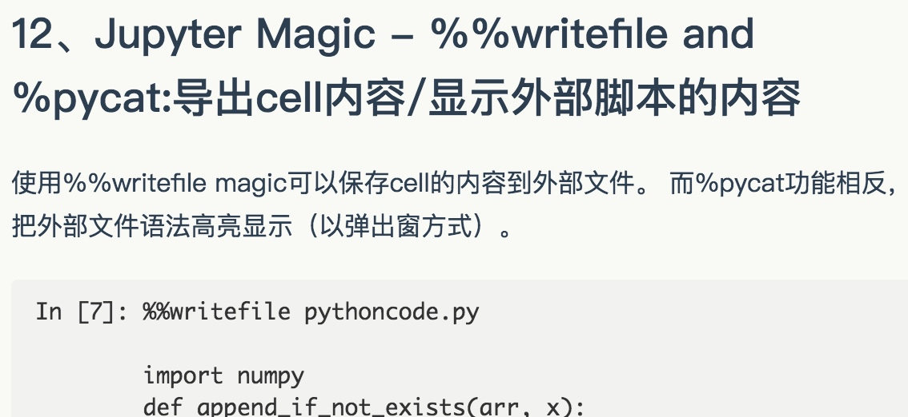
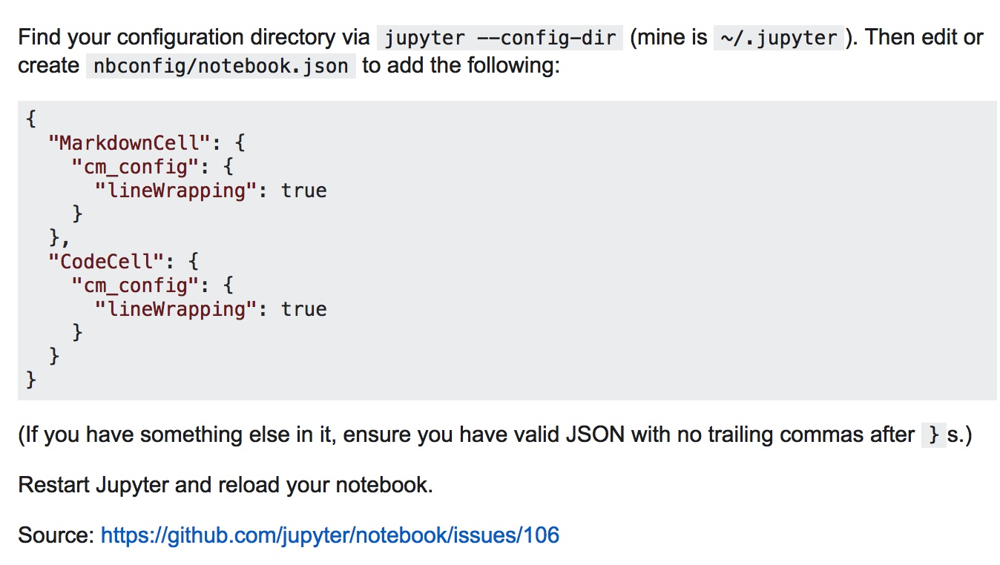
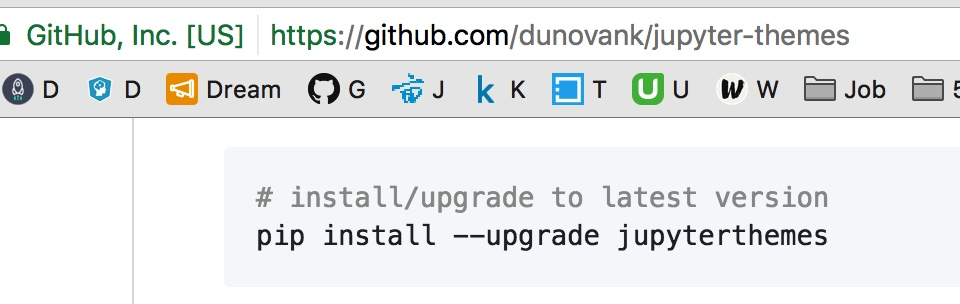

from IPython.core.interactiveshell import InteractiveShell

InteractiveShell.ast\_node\_interactivity = "all"

Use Jupyter notebook remotely
=============================

try `pytraj` online:

Situation: Your data (may be TB) is in your working cluster. You want to access and interactively play with your datayour home computer. You can use xwin to open your Jupyter notebook on remote host. However, this kind of connection is quite slow.

To make the connection faster, you can follow below instructions:

* First, make sure you install Jupyter notebook in both remote (working station in your offcie) and local (your home computer)
* In remote host, open the terminal, change directory to where you have your notebooks and type:

      jupyter notebook --NotebookApp.iopub\_data\_rate\_limit=2147483647 --no-browser --port=8889

    \# you should leave the this open
* In your local computer, open MS-DOS cmd (if using Windows) or Unix terminal, then type:

      ssh -N -f -L localhost:8888: localhost:8889 congyang@urban.cs.wpi.edu

    \# make sure to change `username` to your real username in remote host
    \# change `your\_remote\_host\_name` to your address of your working station
    \# Example: ssh -N -f -L localhost:8888:localhost:8889 laura@cs.rutgers.edu
* Now open web browser (google chrome, firefox, ...) and type:

      localhost:8888
    \# you will see your notebooks in your given directory

      which displays your remotely running IPython notebook server.

    ---

      To close the SSH tunnel on the local machine, look for the process and kill it manually:

    ```
    local\_user@local\_host$ ps aux | grep localhost:8889 local\_user 18418 0.0 0.0 41488 684 ? Ss 17:27 0:00 ssh -N -f -L localhost:8888:localhost:8889 remote\_user@remote\_host local\_user 18424 0.0 0.0 11572 932 pts/6 S+ 17:27 0:00 grep localhost:8889 local\_user@local\_host$ kill -15 18418
    ```

      Alternatively, you can start the tunnel without the -f option. The process will then remain in the foreground and can be killed with ctrl-c.

      On the remote machine, kill the IPython server with ctrl-c ctrl-c.

This worked for me on Ubuntu 16.04:

```
python2 -m pip install ipykernel
python2 -m ipykernel install --user

python3 -m pip install ipykernel
python3 -m ipykernel install --user

```

Reference to the documentation:
[Kernels for Python 2 and 3](https://ipython.readthedocs.io/en/latest/install/kernel_install.html#kernels-for-python-2-and-3). Installing the IPython kernel - IPython Docs.


### 2\. Pretty Display of Varibles[](http://liuchengxu.org/pelican-blog/jupyter-notebook-tips.html#2.-Pretty-Display-of-Varibles)

这部分内容可能很多人都知道。如果对带有一个变量或是未赋值语句的cell执行操作，Jupyter 将会自动打印该变量而无需一个输出语句。这非常有用，尤其是使用 Pandas DataFrames 进行处理时，因为输出将会被整齐地格式化为一个表格。

接下来的内容可能没那么人知道：你可以选择修改 `ast_note_iteractively` kernal 选项来使得 Jupyter 为每一行的变量或语句执行这个操作，以便你可以立即看到多条语句一起输出。

In [17]:

    line1 = "this is from line 1"
    line2 = "this is from line 2"

    line1
    line2

Out[17]:

    'this is from line 2'

In [18]:

    from IPython.core.interactiveshell import InteractiveShell
    InteractiveShell.ast\_node\_interactivity = "all"

In [19]:

    line1
    line2

Out[19]:

    'this is from line 1'

Out[19]:

    'this is from line 2'

如果你想要所有的Jupyter实例（Notebook和Console）都设置该选项，只需创建 `~/.ipython/profile_default/ipython_config.py` 文件并写入一下内容：

    c = get\_config()
    \# Run all nodes interactively
    c.InteractiveShell.ast\_node\_interactivity = "all"

### Drop duplicates in the first name column, but take the last obs in the duplicated set

    df.drop\_duplicates(['first\_name'], keep='last')

```python
Tips-Jupyter Notebook

from IPython.display import display # for the multiple output
import pandas as pd # for data reading and pre-processing
import numpy as np # for the model building
import matplotlib.pyplot as plt # for the visualization
import seaborn as sns # for the visualization
%matplotlib inline 
```

编辑模式下按 control + shift + - 可拆分cell 

[Jupyter Notebook的27个秘诀，技巧和快捷键 - 作业部落 Cmd Markdown 编辑阅读器](https://www.zybuluo.com/hanxiaoyang/note/534296)

****

[Question: how to install Python 2.7 as an additional kernel next to the default Python 3.X one? · Issue \#71 · jupyter/jupyter](https://github.com/jupyter/jupyter/issues/71)




**26**、大数据分析

很多方案可以解决查询/处理大数据的问题：

* [ipyparallel](https://github.com/ipython/ipyparallel)（之前叫 ipython cluster） 是一个在python中进行简单的map-reduce运算的良好选择。我们在rep中使用它来并行训练很多机器学习模型。
* [pyspark](http://www.cloudera.com/documentation/enterprise/5-5-x/topics/spark_ipython.html)
* [spark-sql magic](https://github.com/jupyter-incubator/sparkmagic) %%sql

****

**27**、分享notebook

分享notebook最方便的方法是使用notebook文件（.ipynb），但是对那些不使用notebook的人，你还有这些选择：

* 通过File \> Download as \> HTML 菜单转换到html文件。
* 用[gists](https://www.dataquest.io/blog/jupyter-notebook-tips-tricks-shortcuts/gist.github.com)或者github分享你的notebook文件。这两个都可以呈现notebook，示例见[链接](https://github.com/dataquestio/solutions/blob/master/Mission202Solution.ipynb)
* 如果你把自己的notebook文件上传到github的仓库，可以使用很便利的[Mybinder](http://mybinder.org/)服务，允许另一个人进行半个小时的Jupyter交互连接到你的仓库。
* 用[jupyterhub](https://github.com/jupyterhub/jupyterhub)建立你自己的系统，这样你在组织微型课堂或者工作坊，无暇顾及学生们的机器时就非常便捷了。
* 将你的notebook存储在像dropbox这样的网站上，然后把链接放在[nbviewer](http://nbviewer.jupyter.org/)，nbviewer可以呈现任意来源的notebook。
* 用菜单File \> Download as \> PDF 保存notebook为PDF文件。如果你选择本方法，我强烈建议你读一读Julius Schulz的[文章](http://blog.juliusschulz.de/blog/ultimate-ipython-notebook)
* 用Pelican从你的notebook[创建一篇博客](https://www.dataquest.io/blog/how-to-setup-a-data-science-blog/)。




鲜为人知的是，你可以通过修改内核选项ast\_note\_interactivity，使得Jupyter对独占一行的所有变量或者语句都自动显示，这样你就可以马上看到多个语句的运行结果了。

from IPython.core.interactiveshell import InteractiveShell

InteractiveShell.ast\_node\_interactivity = "all"

Shift + M 合并cell. 

A = insert cell above

B = insert cell below

Shift + Enter = run the cell



```python

{
  "MarkdownCell": {
    "cm_config": {
      "lineWrapping": true
    }
  },

  "CodeCell": {
    "cm_config": {
      "lineWrapping": true
    }
  }
}
```



[dunovank/jupyter-themes: Custom Jupyter Notebook Themes](https://github.com/dunovank/jupyter-themes)


**Set Plotting Styles (from within notebook)**

****

****

```python
context and font scaling borrowed from seaborn
from jupyterthemes import jtplot

# currently installed theme will be used to
# set plot style if no arguments provided
jtplot.style()

# select an alternative theme's plot style by name
# oceans16 | grade3 | chesterish | onedork | monokai | solarized-light
jtplot.style('onedork')

# set "context" (paper, notebook, talk, or poster)
# & font scale (scalar applied to labels, legend, etc.)
jtplot.style(context='paper', fscale=1.4)

# turn on x and y ticks (default=False)
# & turn off axis grid (default=True)
jtplot.style(ticks=True, grid=False)

# fully reset matplotlib default rcParams
jtplot.reset()
```


