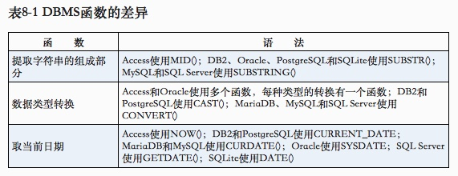
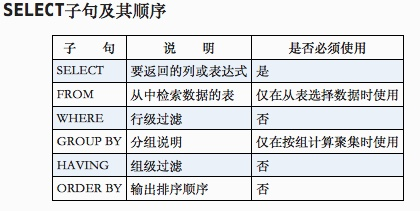

SQL Tips

```sql
distinct works for all columns;
limit 5 offset 6 (jump start from line 7 )
-- this is the comments 
/* Common comment format for
   different language */
order by c1 desc, c2; --asc is the default
order by 1,2; -- this also works
the A and a is the same within the dictionary, so it works in DBMS, the admin can change it

<> != !> ;between x and y; is null;
where A or B and C; -- the and will be do first, the sql running like (A and C), then (or B)
where (A or B) and C;
where vendid IN ("A","B") -- same logic like or, and the IN clause can include the "Select xxxx" and run faster
where NOT A; -- like <> and we can use the NOT IN (Select )
LIKE "Fish%" -- start from Fish % can not match the NUL, % can be 0 wildcard. in access, _ _ match with the single byte
-- % make the SQL query works slow, limit the useage of the %
Select RTRIM(A) + '(' + RTRIM(B) + ')' -- use the RTRIM to delete the right side spaces of the values
trim(), ltrim(), rtrim()
Select RTRIM(A) + '(' + RTRIM(B) + ')' 
AS C -- C could be the alias of the new column in SQL, if the column name is illegal, use the alias 
select Now() -- return you the current date and time
```



```sql
The distinct function in different DBMS, should be care about. We should consider the portable.
-- 常用的文本处理函数
-- 函　　数	说　　明
LEFT() -- （或使用子字符串函数）	返回字符串左边的字符
LENGTH() -- （也使用DATALENGTH()或LEN()）	返回字符串的长度
LOWER() -- （Access使用LCASE()）	将字符串转换为小写
LTRIM() -- 	去掉字符串左边的空格
RIGHT() -- （或使用子字符串函数）	返回字符串右边的字符
RTRIM() -- 	去掉字符串右边的空格
SOUNDEX() -- 	返回字符串的SOUNDEX值
UPPER() -- （Access使用UCASE()）	将字符串转换为大写”

soundex(A) = soundex('Michael Green') -- SQL can return the similar prounance results, like Michelle Green.

AVG() -- ignore the row which the target column value is NULL
select avg(distinct A) -- just calulate the specific products, unralated with count of products
COUNT(*) count all rows includes NULL row
COUNT(colum) count all rows excludes NULL row
对非数值数据使用MAX()
MAX()一般用来找出最大的数值或日期值，但许多（并非所有）DBMS允许将它用来返回任意列中的最大值，包括返回文本列中的最大值。在用于文本数据时，MAX()返回按该列排序后的最后一行。”
MAX() ingore NULL row

GROUP BY
- GROUP BY子句可以包含任意数目的列，因而可以对分组进行嵌套，更细致地进行数据分组。
- 如果在GROUP BY子句中嵌套了分组，数据将在最后指定的分组上进行汇总。换句话说，在建立分组时，指定的所有列都一起计算（所以不能从个别的列取回数据）。
- GROUP BY子句中列出的每一列都必须是检索列或有效的表达式（但不能是聚集函数）。如果在SELECT中使用表达式，则必须在GROUP BY子句中指定相同的表达式。不能使用别名。
- 除聚集计算语句外，SELECT语句中的每一列都必须在GROUP BY子句中给出。”

HAVING
-- “目前为止所学过的所有类型的WHERE 子句都可以用HAVING来替代。唯一的差别是，WHERE过滤行，而HAVING过滤分组。”
-- having support all where operator

HAVING和WHERE的差别
-- 这里有另一种理解方法，WHERE在数据分组前进行过滤，HAVING在数据分组后进行过滤。这是一个重要的区别，WHERE排除的行不包括在分组中。这可能会改变计算值，从而影响HAVING子句中基于这些值过滤掉的分组。”

```




Data Insert

```sql

```


## Query

```sql
show full processlist;
kill *****;
desc tablename
-- ssss
source ~/.bash_profile
mysql -u root -p
123456
use database
source sql.file path

group by column , no quote

mysql -u USERNAME -pPASSWORD -h REMOTE_SERVER_IP DB_NAME
```

```sql
-- String to Date in MySQL
SET expired_date = STR_TO_DATE(@expired_date, '%m/%d/%Y');
```

```sql
-- Load csv in S3 to remote MySQL Server.


-- Tranfer data from one remote MySQL Server to S3 and to another MySQL Server.

sqoop import --connect jdbc:mysql://smb-dwh-cluster.cluster-c9teojsqesw4.us-west-2.rds.amazonaws.com/cc_dwh --username smb_app_user --password smb4ppus3r --table guam_subscriptions --target-dir s3://pbdl-bda-smb/personalization/guam_subscriptions --fields-terminated-by '|' --input-lines-terminated-by '\n' --null-string '\\\\N' --null-non-string '\\\\N' --input-null-string '\\\\N' --input-null-non-string '\\\\N' -m 1

sqoop export --connect jdbc:mysql://horizon-reporting-57.ctz5iw1v2fh7.us-west-2.rds.amazonaws.com/cc_dwh --username horizon --password horizon123 --table guam_subscriptions --export-dir s3://pbdl-bda-smb/personalization/guam_subscriptions --input-fields-terminated-by '|' --input-lines-terminated-by '\n' --null-string '\\\\N' --null-non-string '\\\\N' --input-null-string '\\\\N' --input-null-non-string '\\\\N' -m 1
```


```sql
LOAD DATA local INFILE '/Users/Coyawa/Downloads/us_leasingcontracs.csv' 
INTO TABLE sas_leasingcontract 
FIELDS TERMINATED BY ',' 
ENCLOSED BY '"'
LINES TERMINATED BY '\n'
IGNORE 1 ROWS;
```


```sql
-- S3 URL
http://pbdl-bda-xbec.s3.amazonaws.com/staging/sharedworkspace/congyang_pipeline/sas_billingplan/us_billingplan.csv
-- S3 Path
s3://pbdl-bda-xbec/staging/sharedworkspace/congyang_pipeline/sas_billingplan/us_billingplan.csv
```


```sh
# Insert data from SQL Dump file
sudo mysql -h ssto-reporting.ctz5iw1v2fh7.us-west-2.rds.amazonaws.com -u horizon -phorizon123 < ${file}
```

mysql导入数据load data infile用法 - 虎猫 - ITeye博客

http://hunan.iteye.com/blog/752606

```sql
-- Load/Insert csv data in S3 to MySQL Server


-- Copy the schema of create table.

ssh -i ~/wang.pem hadoop@ec2-34-212-233-70.us-west-2.compute.amazonaws.com
-- Mount the new drive in EMR, the files over 5gb
cd /mnt
mkdir xx
cd xx/
-- aws copy csv into EMR
aws s3 cp s3://pbdl-bda-xbec/staging/sharedworkspace/congyang_pipeline/sas_leasingcontracs/sas_leasingcontracs.csv sas_leasingcontracs.csv
aws s3 cp s3://pbdl-bda-xbec/staging/sharedworkspace/congyang_pipeline/sas_billing/us_billing.csv sas_billing.csv
aws s3 cp s3://pbdl-bda-xbec/staging/sharedworkspace/congyang_pipeline/sas_billingplan/us_billingplan.csv sas_billingplan.csv
-- 
mysqlimport -h smb-dwh-dev.cluster-c9teojsqesw4.us-west-2.rds.amazonaws.com -P 3306 -u adhoc_user -p'4dh0cu3er' --local --ignore-lines=1 --fields-terminated-by=','  adhoc_sandbox sas_billingplan.csv 

mysqlimport -h smb-dwh-dev.cluster-c9teojsqesw4.us-west-2.rds.amazonaws.com -P 3306 -u adhoc_user -p'4dh0cu3er' --local --ignore-lines=1 --fields-terminated-by=','  adhoc_sandbox sas_billing.csv 

mysqlimport -h smb-dwh-dev.cluster-c9teojsqesw4.us-west-2.rds.amazonaws.com -P 3306 -u adhoc_user -p'4dh0cu3er' --local --ignore-lines=1 --fields-terminated-by=','  adhoc_sandbox sas_leasingcontracs.csv 


-- Loading the sas_leasingcontracs from csv in s3 to hive table

DROP TABLE sas_leasingcontracs;
CREATE EXTERNAL TABLE sas_leasingcontracs
	 (
		Active_Contract_Status STRING,
		COMPANY_CODE STRING,
		CONTRACT_NUMBER STRING,
		CUSTOMER_SEGMENT STRING,
		FINANCIAL_PRODUCT STRING,
		GOVT_COMM_MUNI_INDICATOR STRING,
		Lease_Expiry_Date STRING,
		Sales_Office STRING,
		Lease_Start_Date STRING,
		LEASE_STATUS_CODE STRING,
		Original_Term_Duration STRING,
		Prime_Period_Contract_Status STRING,
		Remaining_Term STRING,
		SLP_Contract_Status STRING,Sales_Group STRING,
		Customer_Number STRING,
		Original_Residual_Value STRING,
		Term_Duration STRING,
		Terminated_Contract_Status STRING,
		Termination_Date STRING,
		Termination_Reason_Code STRING,
		Financed_Cost STRING,
		Lease_Program_Offer STRING
	 )
ROW FORMAT DELIMITED
FIELDS TERMINATED BY ','
LINES TERMINATED BY '\n'
STORED AS INPUTFORMAT
'org.apache.hadoop.mapred.TextInputFormat'
OUTPUTFORMAT
'org.apache.hadoop.hive.ql.io.HiveIgnoreKeyTextOutputFormat'
LOCATION
's3://pbdl-bda-xbec/staging/sharedworkspace/congyang_pipeline/sas_leasingcontracs/'
tblproperties ("skip.header.line.count"="1")

```


**MySQL DATE\_FORMAT() Function**

https://www.w3schools.com/sql/func\_mysql\_date\_format.asp


```sql
-- Create Table from query
CREATE TABLE adhoc_sandbox.smb_plan AS
	SELECT bpn, created, company_name
	FROM cc_dwh.aria_subscriptions
	
ALTER TABLE adhoc_sandbox.smb_plan
ADD PRIMARY KEY (bpn);

```


SQL 通配符
-------

在搜索数据库中的数据时，SQL 通配符可以替代一个或多个字符。

SQL 通配符必须与 LIKE 运算符一起使用。

在 SQL 中，可使用以下通配符：

通配符描述%替代一个或多个字符

```sql
SELECT * FROM Persons
WHERE City LIKE 'Ne%'
```


If the value appears more than once.

```sql
select * 
from sfdc_contacts 
where okta_id  
in(
  select okta_id 
  from sfdc_contacts 
  group by okta_id 
  having COUNT(okta_id) >1
  )
```


```sql
SELECT * FROM automoto WHERE (title LIKE '%$keyword%')
```


```sql
做项目需要用到联合唯一
例如，user表中有user_id,user_name两个字段，如果不希望有两条一摸一样的的user_id和user_name，需要给user表添加两个字段的联合唯一索引：
alter table user add unique index(user_id,user_name);
这样当向表中添加相同记录的时候，会返回1062的添加失败信息。
但是有一种情况是表中已经有n个重复的记录，这时候我们才想起来要添加唯一索引，再执行上面的操作时，数据库会告诉你已经有重复的记录了，建立索引失败，这时候，我们可以用下面的操作：
alter ignore table user add unique index(user_id,user_name);
它会删除重复的记录（别怕，会保留一条），然后建立唯一索引，高效而且人性化。


MySql 删除重复记录

数据库
MySql
1、 查找表中多余的重复记录，重复记录是根据单个字段（peopleId）来判断
select * from people
where peopleId in (select   peopleId  from   people  group  by   peopleId  having  count(peopleId) > 1)
2、 删除表中多余的重复记录，重复记录是根据单个字段（peopleId）来判断，只留有 rowid 最小的记录
delete from people 
where peopleId  in (select   peopleId  from people  group  by   peopleId   having  count(peopleId) > 1)
and rowid not in (select min(rowid) from   people  group by peopleId  having count(peopleId )>1)
3、查找表中多余的重复记录（多个字段）
select * from vitae a
where (a.peopleId,a.seq) in   (select peopleId,seq from vitae group by peopleId,seq  having count(*) > 1)
4、删除表中多余的重复记录（多个字段），只留有 rowid 最小的记录
delete from vitae a
where (a.peopleId,a.seq) in   (select peopleId,seq from vitae group by peopleId,seq having count(*) > 1)
and rowid not in (select min(rowid) from vitae group by peopleId,seq having count(*)>1)
5、查找表中多余的重复记录（多个字段），不包含 rowid 最小的记录
select * from vitae a
where (a.peopleId,a.seq) in   (select peopleId,seq from vitae group by peopleId,seq having count(*) > 1)
and rowid not in (select min(rowid) from vitae group by peopleId,seq having count(*)>1)
6、 比方说，在 A 表中存在一个字段 “name”，而且不同记录之间的“name” 值有可能会相同，现在就是需要查询出在该表中的各记录之间，“name”值存在重复的项；
Select Name,Count(*) From A Group By Name Having Count(*) > 1
如果还查性别也相同大则如下:
Select Name,sex,Count(*) From A Group By Name,sex Having Count(*) > 1
有两个意义上的重复记录，一是完全重复的记录，也即所有字段均重复的记录，二是部分关键字段重复的记录，比如 Name 字段重复，而其他字段不一定重复或都重复可以忽略。
（1）对于第一种重复，比较容易解决，使用
select distinct * from tableName
就可以得到无重复记录的结果集。
如果该表需要删除重复的记录（重复记录保留 1 条），可以按以下方法删除
select distinct * into #Tmp from tableName
drop table tableName
select * into tableName from #Tmp
drop table #Tmp
发生这种重复的原因是表设计不周产生的，增加唯一索引列即可解决。
（2）这类重复问题通常要求保留重复记录中的第一条记录，操作方法如下
假设有重复的字段为 Name,Address，要求得到这两个字段唯一的结果集
select identity(int,1,1) as autoID, * into #Tmp from tableName
select min(autoID) as autoID into #Tmp2 from #Tmp group by Name,autoID
select * from #Tmp where autoID in(select autoID from #tmp2)
最后一个 select 即得到了 Name，Address 不重复的结果集（但多了一个 autoID 字段，实际写时可以写在 select 子句中省去此列）
7、 查询重复
select * from tablename where id in (
select id from tablename 
group by id 
having count(id) > 1
)
```


赶集mysql军规
---------

2017-12-25 [架构师之路](https://mp.weixin.qq.com/s/oQstfRFuGOvUVnElRqS5aw##)

总是在灾难发生后，才想起容灾的重要性。
总是在吃过亏后，才记得曾经有人提醒过。

**一，核心军规**

* 不在数据库做计算，cpu计算务必移至业务层
* 控制单表数据量，单表记录控制在千万级
* 控制列数量，字段数控制在20以内
* 平衡范式与冗余，为提高效率可以牺牲范式设计，冗余数据
* 拒绝3B(big)，大sql，大事务，大批量

**二，字段类军规**

* 用好数值类型
tinyint(1Byte)
smallint(2Byte)
mediumint(3Byte)
int(4Byte)
bigint(8Byte)
bad case：int(1)/int(11)
* 有些字符转化为数字
用int而不是char(15)存储ip
* 优先使用enum或set
例如：`sex` enum (‘F’, ‘M’)
* 避免使用NULL字段
NULL字段很难查询优化
NULL字段的索引需要额外空间
NULL字段的复合索引无效
bad case：
`name` char(32) default null
`age` int not null
good case：
`age` int not null default 0
* 不在数据库里存图片

**三，索引类军规**

* 谨慎合理使用索引
改善查询、减慢更新
索引一定不是越多越好（能不加就不加，要加的一定得加）
覆盖记录条数过多不适合建索引，例如“性别”
* 字符字段必须建前缀索引
* 不在索引做列运算
bad case：
select id where age +1 = 10;
* innodb主键合理使用自增列
主键建立聚簇索引
主键不应该被修改
字符串不应该做主键
如果不指定主键，innodb会使用唯一且非空值索引代替
* 不用外键，请由程序保证约束

**四，sql类军规**

* sql语句尽可能简单
一条sql只能在一个cpu运算
大语句拆小语句，减少锁时间
一条大sql可以堵死整个库
* 简单的事务
事务时间尽可能短
bad case：
上传图片事务
* 避免使用触发器，用户自定义函数，请由程序取而代之
* 不用select \*
消耗cpu，io，内存，带宽
这种程序不具有扩展性
* OR改写为IN()
* OR改写为UNION

画外音：最新的mysql内核已经进行了相关优化

* limit高效分页
limit越大，效率越低
select id from t limit 10000, 10;
应该改为 =\>
select id from t where id \> 10000 limit 10;
* 使用union all替代union，union有去重开销
* 尽量不用连接join
* 务必请使用“同类型”进行比较，否则可能全表扫面
* 打散批量更新
* 使用新能分析工具
show profile;
mysqlsla;
mysqldumpslow;
explain;
show slow log;
show processlist;
show query\_response\_time(percona)


58到家数据库30条军规解读
--------------

Original 2017-02-15 58沈剑 [架构师之路](https://mp.weixin.qq.com/s?__biz=MjM5ODYxMDA5OQ==&mid=2651959906&idx=1&sn=2cbdc66cfb5b53cf4327a1e0d18d9b4a&chksm=bd2d07be8a5a8ea86dc3c04eced3f411ee5ec207f73d317245e1fefea1628feb037ad71531bc&scene=21##)

**军规适用场景**：并发量大、数据量大的互联网业务

**军规**：介绍内容

**解读**：讲解原因，解读比军规更重要

**一、基础规范**

**（1）必须使用InnoDB存储引擎**

解读：支持事务、行级锁、并发性能更好、CPU及内存缓存页优化使得资源利用率更高

**（2）必须使用UTF8字符集**

解读：万国码，无需转码，无乱码风险，节省空间

**（3）数据表、数据字段必须加入中文注释**

解读：N年后谁tm知道这个r1,r2,r3字段是干嘛的

**（4）禁止使用存储过程、视图、触发器、Event**

解读：高并发大数据的互联网业务，架构设计思路是“解放数据库CPU，将计算转移到服务层”，并发量大的情况下，这些功能很可能将数据库拖死，业务逻辑放到服务层具备更好的扩展性，能够轻易实现“增机器就加性能”。数据库擅长存储与索引，CPU计算还是上移吧

**（5）禁止存储大文件或者大照片**

解读：为何要让数据库做它不擅长的事情？大文件和照片存储在文件系统，数据库里存URI多好

**二、命名规范**

**（6）只允许使用内网域名，而不是ip连接数据库**

**（7）线上环境、开发环境、测试环境数据库内网域名遵循命名规范**

业务名称：xxx

线上环境：dj.xxx.db

开发环境：dj.xxx.rdb

测试环境：dj.xxx.tdb

**从库**在名称后加-s标识，**备库**在名称后加-ss标识

线上从库：dj.xxx-s.db

线上备库：dj.xxx-sss.db

**（8）库名、表名、字段名：小写，下划线风格，不超过32个字符，必须见名知意，禁止拼音英文混用**

**（9）表名t\_xxx，非唯一索引名idx\_xxx，唯一索引名uniq\_xxx**

**三、表设计规范**

**（10）单实例表数目必须小于500**

**（11）单表列数目必须小于30**

**（12）表必须有主键，例如自增主键**

解读：

a）主键递增，数据行写入可以提高插入性能，可以避免page分裂，减少表碎片提升空间和内存的使用

b）主键要选择较短的数据类型， Innodb引擎普通索引都会保存主键的值，较短的数据类型可以有效的减少索引的磁盘空间，提高索引的缓存效率

c） 无主键的表删除，在row模式的主从架构，会导致备库夯住

**（13）禁止使用外键，如果有外键完整性约束，需要应用程序控制**

解读：外键会导致表与表之间耦合，update与delete操作都会涉及相关联的表，十分影响sql 的性能，甚至会造成死锁。高并发情况下容易造成数据库性能，大数据高并发业务场景数据库使用以性能优先

**四、字段设计规范**

**（14）必须把字段定义为NOT NULL并且提供默认值**

解读：

a）null的列使索引/索引统计/值比较都更加复杂，对MySQL来说更难优化

b）null 这种类型MySQL内部需要进行特殊处理，增加数据库处理记录的复杂性；同等条件下，表中有较多空字段的时候，数据库的处理性能会降低很多

c）null值需要更多的存储空，无论是表还是索引中每行中的null的列都需要额外的空间来标识

d）对null 的处理时候，只能采用is null或is not null，而不能采用=、in、\<、\<\>、!=、not in这些操作符号。如：where name!=’shenjian’，如果存在name为null值的记录，查询结果就不会包含name为null值的记录

**（15）禁止使用TEXT、BLOB类型**

解读：会浪费更多的磁盘和内存空间，非必要的大量的大字段查询会淘汰掉热数据，导致内存命中率急剧降低，影响数据库性能

**（16）禁止使用小数存储货币**

解读：使用整数吧，小数容易导致钱对不上

**（17）必须使用varchar(20)存储手机号**

解读：

a）涉及到区号或者国家代号，可能出现+-()

b）手机号会去做数学运算么？

c）varchar可以支持模糊查询，例如：like“138%”

**（18）禁止使用ENUM，可使用TINYINT代替**

解读：

a）增加新的ENUM值要做DDL操作

b）ENUM的内部实际存储就是整数，你以为自己定义的是字符串？

**五、索引设计规范**

**（19）单表索引建议控制在5个以内**

**（20）单索引字段数不允许超过5个**

解读：字段超过5个时，实际已经起不到有效过滤数据的作用了

**（21）禁止在更新十分频繁、区分度不高的属性上建立索引**

解读：

a）更新会变更B+树，更新频繁的字段建立索引会大大降低数据库性能

b）“性别”这种区分度不大的属性，建立索引是没有什么意义的，不能有效过滤数据，性能与全表扫描类似

**（22）建立组合索引，必须把区分度高的字段放在前面**

解读：能够更加有效的过滤数据

**六、SQL使用规范**

**（23）禁止使用SELECT \*，只获取必要的字段，需要显示说明列属性**

解读：

a）读取不需要的列会增加CPU、IO、NET消耗

b）不能有效的利用覆盖索引

c）使用SELECT \*容易在增加或者删除字段后出现程序BUG

**（24）禁止使用INSERT INTO t\_xxx VALUES(xxx)，必须显示指定插入的列属性**

解读：容易在增加或者删除字段后出现程序BUG

**（25）禁止使用属性隐式转换**

解读：SELECT uid FROM t\_user WHERE phone=13812345678 会导致全表扫描，而不能命中phone索引，猜猜为什么？（这个线上问题不止出现过一次）

**（26）禁止在WHERE条件的属性上使用函数或者表达式**

解读：SELECT uid FROM t\_user WHERE from\_unixtime(day)\>='2017-02-15' 会导致全表扫描

正确的写法是：SELECT uid FROM t\_user WHERE day\>= unix\_timestamp('2017-02-15 00:00:00')

**（27）禁止负向查询，以及%开头的模糊查询**

解读：

a）负向查询条件：NOT、!=、\<\>、!\<、!\>、NOT IN、NOT LIKE等，会导致全表扫描

b）%开头的模糊查询，会导致全表扫描

**（28）禁止大表使用JOIN查询，禁止大表使用子查询**

解读：会产生临时表，消耗较多内存与CPU，极大影响数据库性能

**（29）禁止使用OR条件，必须改为IN查询**

解读：旧版本Mysql的OR查询是不能命中索引的，即使能命中索引，为何要让数据库耗费更多的CPU帮助实施查询优化呢？

**（30）应用程序必须捕获SQL异常，并有相应处理**

总结：大数据量高并发的互联网业务，极大影响数据库性能的都不让用，不让用哟。


