<http://songhuiming.github.io/pages/2017/04/02/jupyter-and-pandas-display/>

```sh
pd.set_option('display.height', 1000)
pd.set_option('display.max_rows', 500)
pd.set_option('display.max_columns', 500)
pd.set_option('display.width', 1000)
# to show all records in jupyternotebook
```


<http://www.gregreda.com/2013/10/26/working-with-pandas-dataframes/>

Tips:

Pandas Ufuncs and why they are so much better than apply command

Note that apply is just a little bit faster than a python for loop! That’s why it is most recommended using pandas builtin [ufuncs](https://docs.scipy.org/doc/numpy/reference/ufuncs.html) for applying preprocessing tasks on columns

```python
df.groupby('name')['activity'].value_counts()
df.groupby('name')['activity'].value_counts().unstack().fillna(0)
#By doing unstack we are transforming the last level of the index to the columns.
```

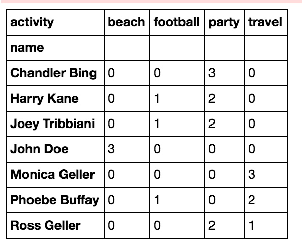

```python
df = df.sort_values(by=['name','timestamp'])
df['time_diff'] = df['timestamp'].diff()
df.loc[df.name != df.name.shift(), 'time_diff'] = None
# BTW the useful .Shift command shift all the column down per one space, so we can see on which row this column is changing by doing this: df.name!=df.name.shift().
# And .loc command is the most recommended way to set values for a column for specific indices.
```


Tips-Pandas

**reading multiple data files using a loop**

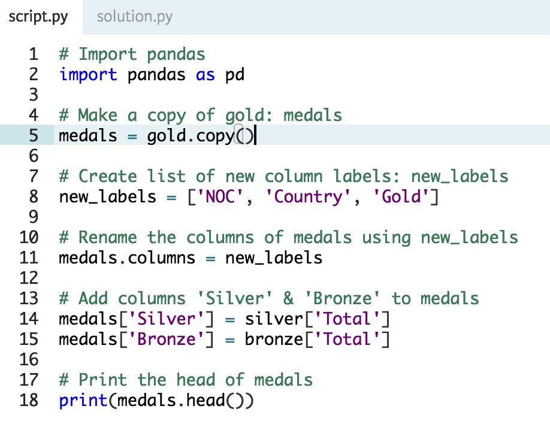

**Sorting DataFrame with the Index & columns**

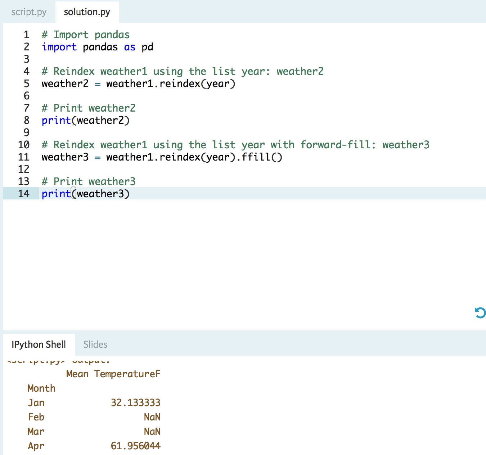

**Reindexing using another DataFrame Index**

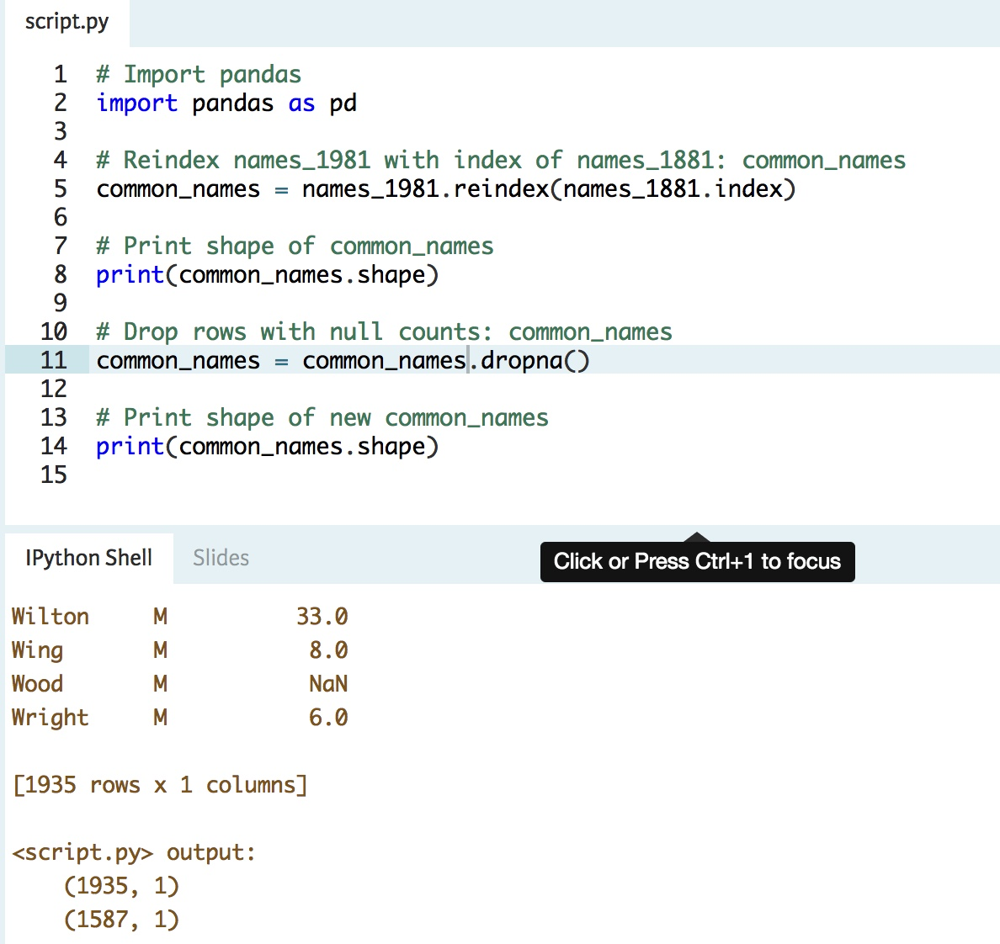

**Arithmetic with Series & DataFrames**

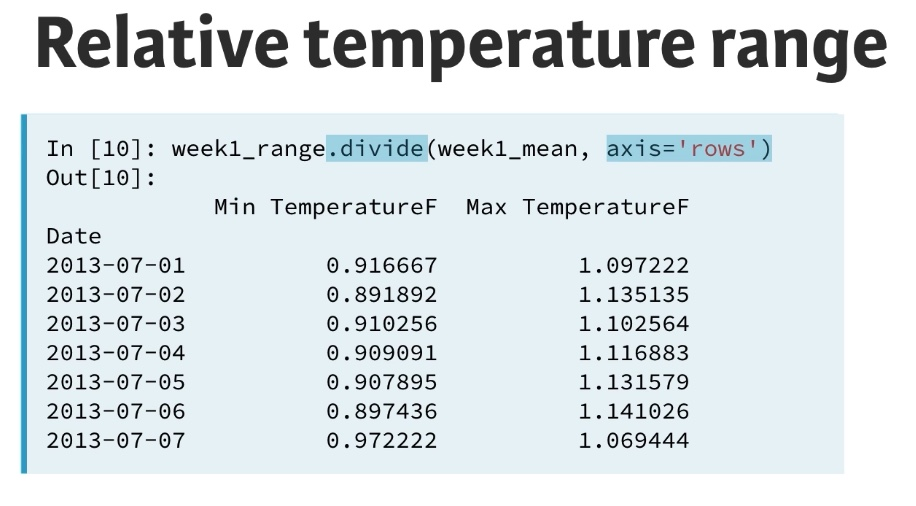

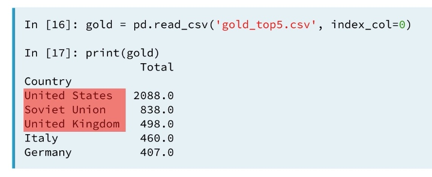

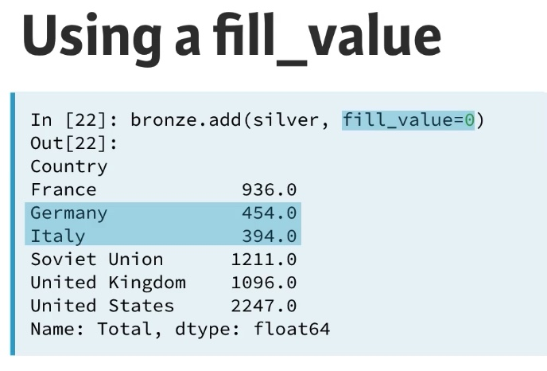

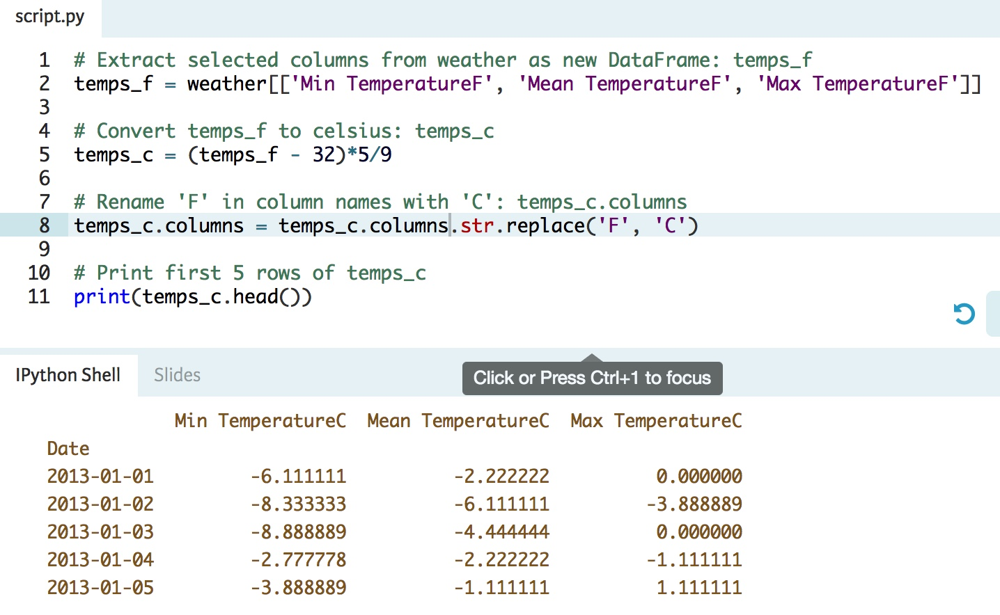

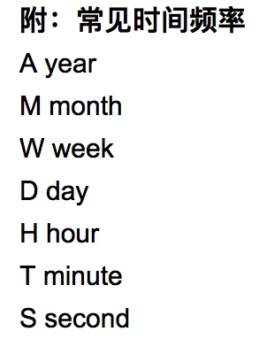

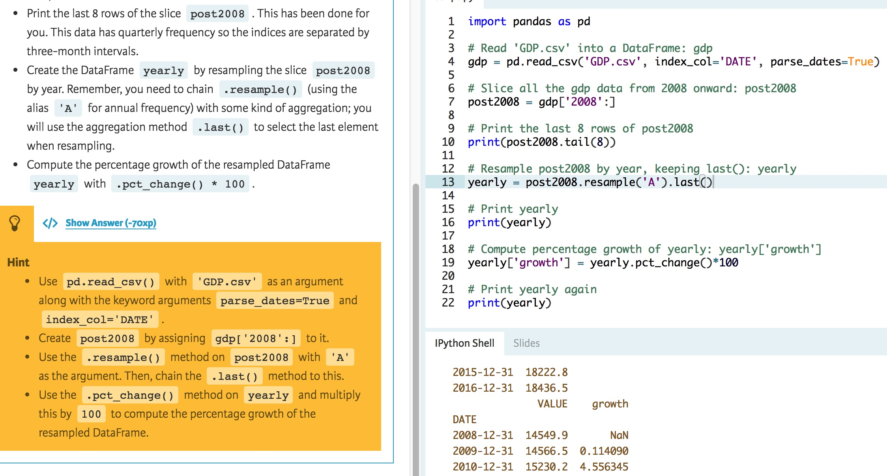

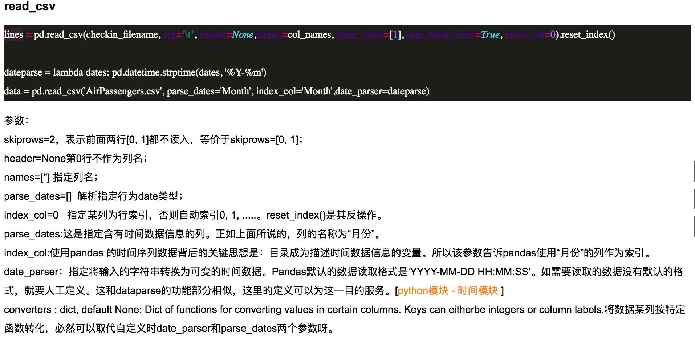

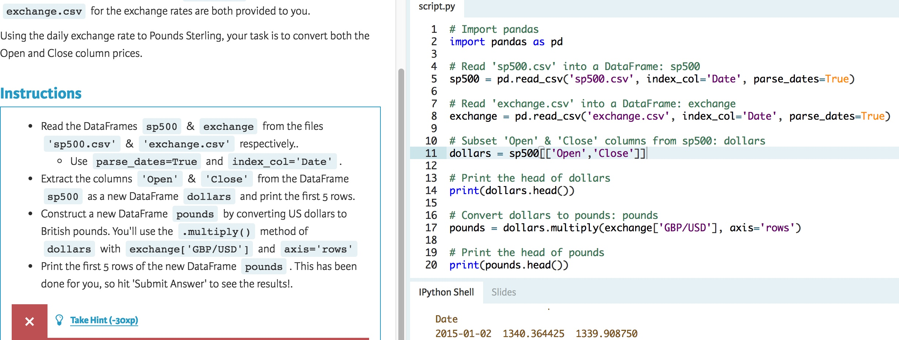

pandas.read\_json[](https://pandas.pydata.org/pandas-docs/stable/generated/pandas.read_json.html#pandas-read-json "Permalink to this headline")
===============================================================================================================================================

`pandas.``read_json`(*path\_or\_buf=None*, *orient=None*, *typ='frame'*, *dtype=True*, *convert\_axes=True*, *convert\_dates=True*, *keep\_default\_dates=True*, *numpy=False*, *precise\_float=False*, *date\_unit=None*, *encoding=None*, *lines=False*)[[source]](http://github.com/pandas-dev/pandas/blob/v0.20.3/pandas/io/json/json.py#L172-L363)[](https://pandas.pydata.org/pandas-docs/stable/generated/pandas.read_json.html#pandas.read_json "Permalink to this definition")

Convert a JSON string to pandas object

Parameters:

**path\_or\_buf** : a valid JSON string or file-like, default: None

> The string could be a URL. Valid URL schemes include http, ftp, s3, and file. For file URLs, a host is expected. For instance, a local file could be `file://localhost/path/to/table.json`

**orient** : string,

> Indication of expected JSON string format. Compatible JSON strings can be produced by `to\_json()` with a corresponding orient value. The set of possible orients is:
> 
> * `'split'` : dict like `{index -\> [index], columns -\> [columns], data -\>[values]}`
> * `'records'` : list like `[{column -\> value}, ... , {column -\> value}]`
> * `'index'` : dict like `{index -\> {column -\> value}}`
> * `'columns'` : dict like `{column -\> {index -\> value}}`
> * `'values'` : just the values array
> 
> The allowed and default values depend on the value of the typ parameter.
> 
> * when `typ == 'series'`,
>   * allowed orients are `{'split','records','index'}`
>   * default is `'index'`
>   * The Series index must be unique for orient `'index'`.
> * when `typ == 'frame'`,
>   * allowed orients are `{'split','records','index', 'columns','values'}`
>   * default is `'columns'`
>   * The DataFrame index must be unique for orients `'index'` and `'columns'`.
>   * The DataFrame columns must be unique for orients `'index'`, `'columns'`, and `'records'`.

**typ** : type of object to recover (series or frame), default ‘frame’

**dtype** : boolean or dict, default True

> If True, infer dtypes, if a dict of column to dtype, then use those, if False, then don’t infer dtypes at all, applies only to the data.