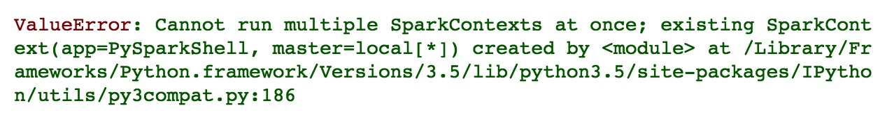
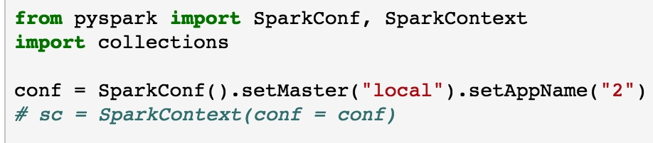
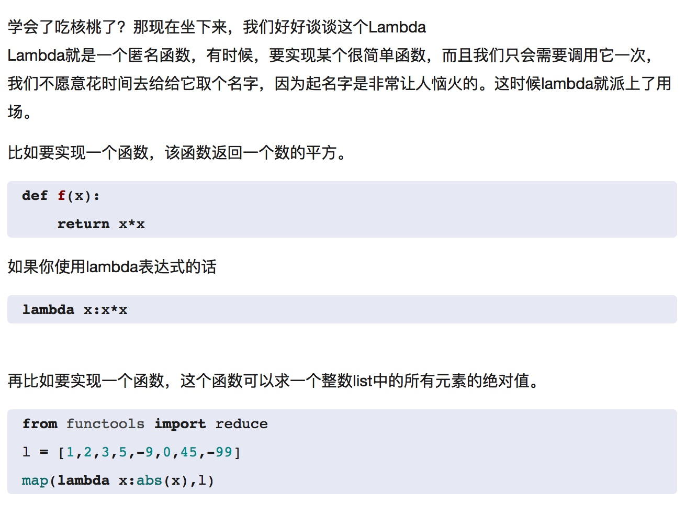
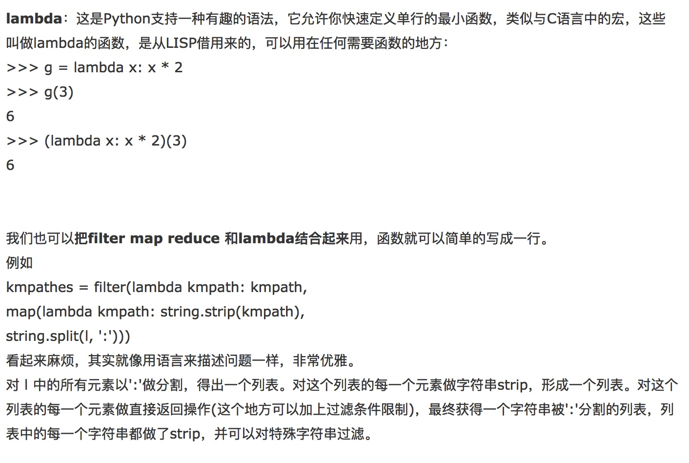

Tips-Spark

****

****

**Add empty line**

+ "\\n"

transformation: like map(), filter()

Action: like count()

完成上述步骤之后，可以键入如下命令退出Spark Shell窗口：

:quit

[Lambda 表达式有何用处？如何使用？ - Python - 知乎](https://www.google.com/url?sa=t&rct=j&q=&esrc=s&source=web&cd=1&ved=0ahUKEwjPhev-9NvSAhWG7SYKHQU0BBIQFggcMAA&url=https%253A%252F%252Fwww.zhihu.com%252Fquestion%252F20125256&usg=AFQjCNHT_fBJDZ3o3r61V86gYncOODn7_w&sig2=lwkQyqUd3dekvVkeHQo4UQ&cad=rja)

[Python中filter、map、reduce、lambda 的用法\_云淡风轻\_新浪博客](https://www.google.com/url?sa=t&rct=j&q=&esrc=s&source=web&cd=3&ved=0ahUKEwjPhev-9NvSAhWG7SYKHQU0BBIQFggtMAI&url=http%253A%252F%252Fblog.sina.com.cn%252Fs%252Fblog_6dbaeb9b0101dzle.html&usg=AFQjCNGCeDqjUniNLZYAFToZSlPAvRsJ4Q&sig2=4w-XzEhRnUvPv78D5W772g&cad=rja)

 df.show(df.count(), False)