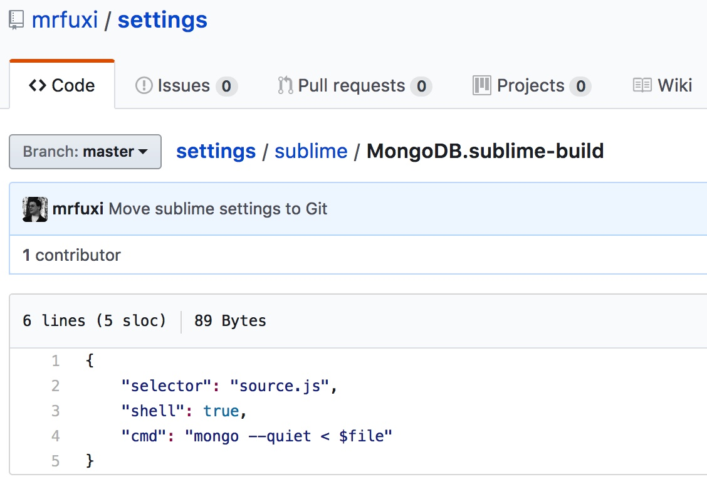

[一个前端程序猿的Sublime Text3的自我修养 | 三省吾身丶丶](http://blog.guowenfh.com/2015/12/26/SublimeText/)

[settings/MongoDB.sublime-build at master · mrfuxi/settings · GitHub](https://www.google.com/url?sa=t&rct=j&q=&esrc=s&source=web&cd=2&ved=0ahUKEwi-pPCCmITTAhXlxYMKHW6zDl8QFgghMAE&url=https%253A%252F%252Fgithub.com%252Fmrfuxi%252Fsettings%252Fblob%252Fmaster%252Fsublime%252FMongoDB.sublime-build&usg=AFQjCNFb2fU0iznvfKZemRzK27WhuL3duA&sig2=Kheu749UJjncQ-ZFyhjYhA&bvm=bv.151325232,d.amc&cad=rja)

Every language has it own line-comment & paragraph-comment

Tips-Sublime Text 3

**Emmet** uses CSS-like selector syntax, You write CSS-like abbreviations, place your cursor at the end of abbreviation and then press Tab , Ctrl+E or any other keyboard key configured to expand abbreviations into actual HTML code. **Emmet** expands a into \<a href=""\>\</a\> .Dec 5, 2013