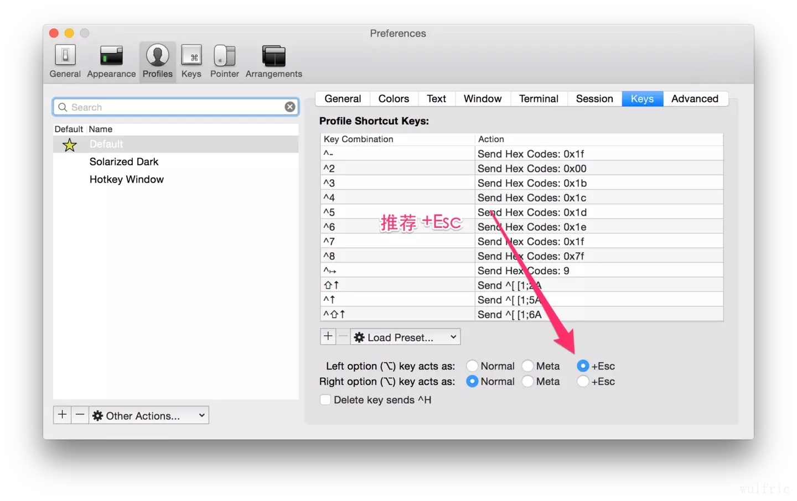
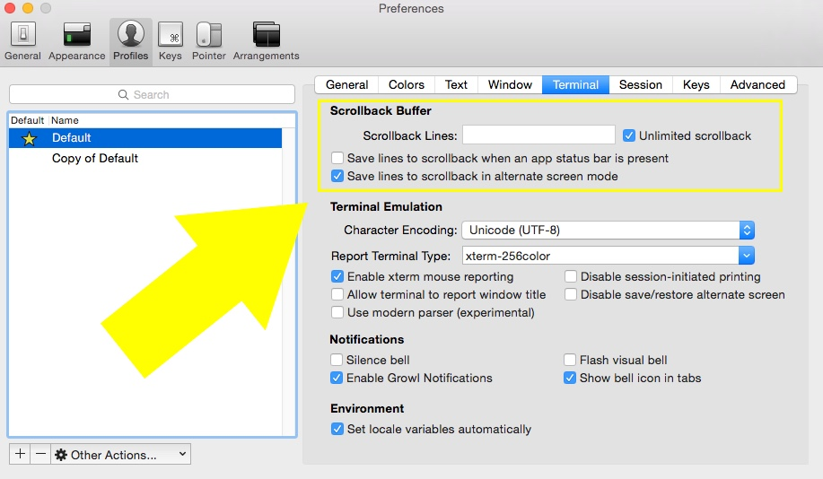

Tips-Terminal

left **alt** already project to the **+Esc**, so hold the **alt**, click the mouse, the cursor will go to the location you click

```python
ls *** | head
#show the vertical list of the folders
```

Tab 可以使terminal里面把下面所有可能的文件或者文件夹列出来，如果结果唯一，可以自动补全

[custom-iterm-applescripts-for-alfred/](https://github.com/stuartcryan/custom-iterm-applescripts-for-alfred/blob/master/custom_iterm_script_iterm_2.9.applescript)

[你应该知道的 iTerm2 使用方法--MAC终端工具](http://wulfric.me/2015/08/iterm2/)

智能选中

在 iTerm2 中，双击选中，三击选中整行，四击智能选中（智能规则可[配置](http://www.iterm2.com/documentation-smart-selection.html)），可以识别网址，引号引起的字符串，邮箱地址等。（很多时候双击的选中就已经很智能了）

在 iTerm2 中，选中即复制。即任何选中状态的字符串都被放到了系统剪切板中。

巧用 Command 键

按住⌘键:

* 可以拖拽选中的字符串；
* 点击 url：调用默认浏览器访问该网址；
* 点击文件：调用默认程序打开文件；
* 如果文件名是filename:42，且默认文本编辑器是 Macvim、Textmate或BBEdit，将会直接打开到这一行；
* 点击文件夹：在 finder 中打开该文件夹；
* 同时按住option键，可以以矩形选中，类似于vim中的ctrl v操作。

**Meta **键

在emacs中，meta键的使用非常频繁，而 OSX 系统没有提供meta键。在 iTerm2 中可以选择左右两个的Option键作为meta键。官方推荐的配置如下图所示。右Option键依然是 OSX 的默认功能（输入特殊字符）。



iTerm2 meta key

Meta + l == ls

常用快捷键

* 切换 tab：⌘+←, ⌘+→, ⌘+{, ⌘+}。⌘+数字直接定位到该 tab；
* 新建 tab：⌘+t；
* 顺序切换 pane：⌘+[, ⌘+]；
* 按方向切换 pane：⌘+Option+方向键；
* 切分屏幕：⌘+d 水平切分，⌘+Shift+d 垂直切分；
* 智能查找，支持正则查找：⌘+f。

[](http://wulfric.qiniudn.com/R-iterm2-find.png-origin.webp)

iTerm2 find

自动完成

iTerm2 可以自动补齐命令，输入若干字符，按⌘+;弹出自动补齐窗口，列出曾经使用过的命令。

[](http://wulfric.qiniudn.com/R-iterm2-autocomplete.png-origin.webp)

iTerm2 autocomplete

iTerm2 也可以使用历史记录，按⌘+Shift+h弹出历史粘贴记录窗口，⌘+Shift+;弹出历史命令记录窗口。

[](http://wulfric.qiniudn.com/R-iterm2-copy-history.png-origin.webp)

iTerm2 copy history

**Exposé Tabs**

⌘+Option+e全屏展示所有的 tab，可以搜索。

[](http://wulfric.qiniudn.com/iterm2-expose.png-origin.webp)

iTerm2 exposé

高亮当前鼠标的位置

一个标签页中开的窗口太多，有时候会找不到当前的鼠标，⌘+/找到它。

[](http://wulfric.qiniudn.com/iterm2-highlight.png-origin.webp)

iTerm2 highlight

配色

你可以自由定制喜欢的配色，[这里](http://iterm2colorschemes.com/) 收集了大量 iTerm2 的主题，你可以选择使用。我用的是Zenburn。在其 github repo 里下载对应的xxx.itermcolors文件，双击安装使用。

Command + d split the shell

[](http://wulfric.qiniudn.com/iterm2-color.png-origin.webp)

iTerm2 color

**mosh**

[mosh](https://mosh.mit.edu/) 是全平台更好的 ssh 工具，更健壮，支持断续连接，支持除了 iPhone 之外的几乎任何平台。（iOS 让人爱不释手的优点，也正是它让人恨之入骨的缺点）

在 OSX 下安装brew install mobile-shell，其他平台请参考官方[教程](https://mosh.mit.edu/#getting)。

[](http://wulfric.qiniudn.com/R-mosh.png-origin.webp)

mosh

从上面来看，mosh 最主要的优点就是，断网了，休眠了，mosh的连接不会断。亲测一个 mosh 连接开了几个月一直没断。

* open the iTerm2 preferences ⌘ + ,
* select the Profiles tab
* then select the Terminal subtab
* **Beware, changes to the `Scrollback lines` value take effect immediately so check `Unlimited scrollback` now if you don't want to delete your current buffer(s)**
* change the value of the `Scrollback Lines` to whatever you'd like
* Uncheck the `Unlimited scrollback` option if you'd like to use your `Scrollback lines`value




